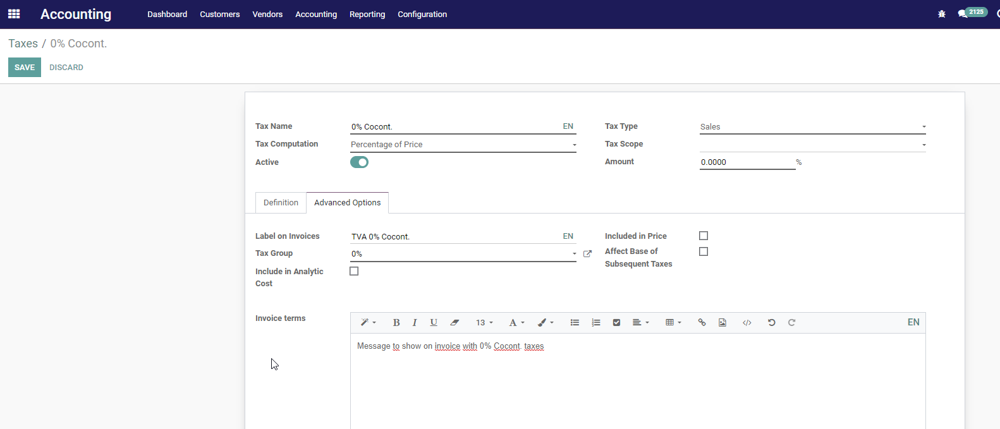

# accounting
Apps related to Odoo it's accounting features
- [account_followup_exclude_partners](#account_followup_exclude_partners): exclude some partners from automatically sending payment reminders
- [invoice_legal_terms](#invoice_legal_terms): Configure legal terms per tax. The terms will be displayed on the invoice pdf.

## account_followup_exclude_partners
This module adds support to configure for specific partners to not send them payment reminders, even though all conditions are met. 
Sometimes you have some customers that you do not really want to send a reminder (e.g because they are very sensitive to it or need longer). 
This is now configurable on the contact itself:

If the option is checked on (by default) we will follow the default Odoo configuration/rules. 
If checked off the reminder(s) will **not** be sent to the customer(s).

## invoice_legal_terms
This module allows you to configure specific invoice terms per tax. 
These terms will be displayed at the bottom of the invoice PDF.

